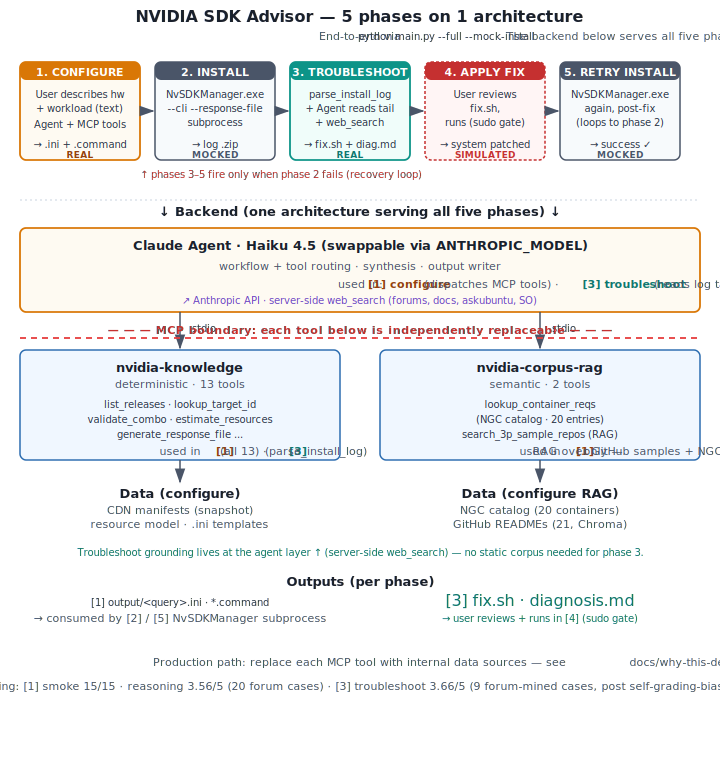

# NVIDIA SDK Advisor

*A design study targeting the NVIDIA SDK Manager + Jetson Developer Experience problem space — agents + MCP + RAG applied to developer tooling.*

A conversational agent that helps developers **discover, configure, install, and troubleshoot** NVIDIA SDKs, built on the same public data sources SDK Manager itself uses. Generates `.ini` response files SDK Manager natively consumes, and optionally drives `NvSDKManager.exe` to completion via subprocess.

[](#evaluation) [](#evaluation) [](#evaluation) [](#tests)


<details><summary><b>Text-only sample (configure phase, GIF unavailable?)</b></summary>

```
> Orin NX, run YOLOv8 object detection at 30fps

  → lookup_target_id           JETSON_ORIN_NX_TARGETS
  → search_3p_sample_repos     jetson-inference DetectNet (top hit)
  → list_releases              JetPack 6.2.2, 6.2.1, 6.2, 6.1, 5.1.6
  → estimate_resources         target 22GB, host 35GB, RAM 1.7GB
  → generate_response_file
  → generate_command

Plan: Jetson · JetPack 6.2.2 · JETSON_ORIN_NX_TARGETS · ubuntu22.04 · DeepStream 7.0
✓ saved: output/orin_nx_yolov8.{ini,command}
```

</details>

> **The demo.** `python main.py --full --mock-install --query "..."` — chains all five phases (configure → install → troubleshoot → fix → retry) with every MCP tool call, every piece of agent reasoning, and every `web_search` query rendered as a discrete step. Phases 1 (configure) and 3 (troubleshoot) are real Anthropic API + real MCP dispatch + real web_search; phases 2/5 (install/retry) are mocked because no Jetson is plugged in; phase 4 (apply fix) is simulated. Each panel carries an explicit REAL / MOCKED / SIMULATED tag so the boundary stays honest. [Recording recipe](docs/demo/README.md).



> **The architecture.** Five phases share one Agent + MCP + RAG backend. Red dashed line = the replaceable boundary. See [MCP design](#mcp-design) · [RAG design](#rag-design).

> **The headline finding.** Opus 4.7 alone scored **46.7%** on factual NVIDIA SDK questions. With the MCP tool layer attached, both Haiku 4.5 and Opus 4.7 scored **100% (15/15)**. The tool layer, not the model, is where the accuracy lives. → [Tool-layer ablation](#tool-layer-ablation)

## What's in this repo

**The thing itself** — [What it does](#what-it-does) · [UX gain](#ux-gain) · [Architecture](#architecture) · [Agent shell design](#agent-shell-design) · [MCP design](#mcp-design) · [RAG design](#rag-design) · [Tested against](#tested-against) · [Evaluation](#evaluation)

**Why it looks like this** — [Design principles](#design-principles)

**What's still open** — [What's still missing](#whats-still-missing) · [Troubleshoot evolution](#troubleshoot-evolution)

**Owner mode** — [If this were to ship](#if-this-were-to-ship--how-i-think-about-it) · [If you're working on something similar](#if-youre-working-on-something-similar)

**Running it** — [Setup](#setup) · [Usage](#usage) · [Tests](#tests) · [Project structure](#project-structure)

**Boundaries** — [Deliberate non-goals](#deliberate-non-goals)

## What it does

| Capability | Where SDK Manager stops today | What this repo adds |
|---|---|---|
| **Discover** | Flat list of NVIDIA-branded SDKs; you must already know which fits your use case | `search_3p_sample_repos` (vector search over 21 GitHub repo READMEs) + workload-to-product inference |
| **Configure** | Silent prune of invalid combinations; no resource preflight; no cross-product reasoning | 13 deterministic tools — `list_releases`, `validate_combo`, `estimate_resources`, `check_constraints` — over NVIDIA's own CDN manifests |
| **Install** | Wizard runs install; CLI takes flags. No conversational guided flow | Generates `.ini` matching NVIDIA's official template, optionally drives `NvSDKManager.exe --cli --response-file` as subprocess with streamed status + event classification |
| **Troubleshoot** | "Export logs" → user reads → user searches forum. No diagnostic surface | `parse_install_log` opens the `.zip`, extracts filename metadata + log tail. The agent reads the raw tail itself and uses `web_search` (forums, askubuntu, stackoverflow) to find expert fixes → synthesizes `fix.sh` + `diagnosis.md`. No pre-classification layer |

## UX gain

Same task, manual workflow vs. agent-assisted (wall-clock estimates from common scenarios, not measured eval):

| Phase | Manual today | This tool | Time | Decisions |
|---|---|---|---|---|
| **Configure** | Read board-ID docs, pick version, navigate GUI, manually check JP×SDK pairing, hope resources fit | One natural-language query → `.ini` + `sdkmanager` cmd | ~30 min → ~2 min (**~15×**) | 7 → 1 |
| **Install** | GUI wizard or CLI flags | `python main.py --execute` drives the subprocess with streamed status | comparable | comparable |
| **Troubleshoot** | Export Logs → unzip → read → Google → forum hunt → pick a fix → try | Auto-finds raw session log, `web_search`-synthesizes `fix.sh` + `diagnosis.md` | ~45 min → ~12 min (**~3.75×**) | 5 → 1 |

The troubleshoot saving carries most of the value. Two architectural choices drive it:

1. **No `--export-logs` step.** SDK Manager already writes raw session logs to `~/.nvsdkm-logs/` (Linux/Mac) or `~/AppData/Local/NVIDIA Corporation/SDK Manager/logs/` (Windows) during install. `--export-logs` just packages them into a tarball for sharing; for local analysis the raw logs are enough. See [`_find_latest_install_log`](src/execution.py#L70-L102).
2. **Synthesize a fix, don't return links.** The agent reads the log tail, dispatches `web_search`, and produces an executable `fix.sh` plus a citation-bearing `diagnosis.md`. Five forum tabs is not a fix. Even at the current Fix-matches-reference score of 2.50/5 (see [Self-grading bias](#self-grading-bias)), "a plausible fix you can immediately try" beats "the correct forum link you'll spend 20 minutes reading".

What this *doesn't* save:

- **`sdkmanager`'s own install time** (~10 min flash). Steps removed are around it, not inside it.
- **High-stakes review.** `--execute` still requires an explicit `yes`; sudo still prompts. Convenience ≠ automation. See [Execution mode safety](#execution-mode-safety).

## Design principles

Three judgments shaped what this repo includes and what it excludes.

1. **The code is evidence, the README is the argument.** Reading the README without running the code should be enough to evaluate the design depth. Running the code without reading the README will miss the point.
2. **Demonstrate the architecture, not the polish.** Every code path exists to make an architectural claim concrete. Polish — CLI ergonomics, exhaustive error handling, every edge case — is deliberately under-invested where it doesn't strengthen the argument.
3. **Surface gaps honestly.** Sections below — [What's still missing](#whats-still-missing), [Troubleshoot evolution](#troubleshoot-evolution) — enumerate what a real product would need that this repo doesn't have. The point is to prove the gaps are understood, not to fill them.

This is a design study with executable evidence, not a tool meant to be adopted as-is.

## Architecture

The [hero diagram](docs/demo/architecture.svg) above shows the 5 phases sharing one backend. This section shows the layer stack — top to bottom is the call path, top to bottom is also the swap boundary: every layer below the MCP line is replaceable without touching the agent loop above.

```
┌──────────────────────────────────────────────────────────────────────┐
│  ENTRY SURFACES (replaceable)                                         │
│                                                                       │
│   main.py --execute      main.py --troubleshoot      main.py --full   │
│   main.py --dry-run      main.py --eval <track>      REPL (default)   │
└────────────────────────┬─────────────────────────────────────────────┘
                         │
                         ▼
┌──────────────────────────────────────────────────────────────────────┐
│  ORCHESTRATOR  (src/orchestrator.py)                                  │
│  5-phase chain: configure → install → troubleshoot → fix → retry      │
│  Tags each phase REAL / MOCKED / SIMULATED in trace output            │
└────────────────────────┬─────────────────────────────────────────────┘
                         │
                         ▼
┌──────────────────────────────────────────────────────────────────────┐
│  AGENT SHELL  (src/agent_shell.py — wrapped by src/agent.py)          │
│                                                                       │
│   SYSTEM_PROMPT  (routing contract)                                   │
│        │                                                              │
│        ▼                                                              │
│   ┌──────────────────────────────────────────────────────────┐       │
│   │  Backend switch (env: ANTHROPIC_BACKEND)                  │       │
│   │  ├─ "sdk"          → Anthropic SDK + Haiku 4.5 (default)  │       │
│   │  ├─ "cli"          → Claude CLI + Opus 4.7                │       │
│   │  └─ "cli-no-tools" → Opus alone (ablation baseline)       │       │
│   └──────────────────────────────────────────────────────────┘       │
│        │                                                              │
│        ▼  tool_use blocks                                             │
│   session_map → dispatch to the correct MCP server                    │
└────────────────────────┬─────────────────────────────────────────────┘
                         │ ════════ MCP boundary (swap line) ════════════
        ┌────────────────┼─────────────────────────────────┐
        ▼                ▼                                 ▼
┌────────────────┐ ┌────────────────┐   ┌─────────────────────────────┐
│ MCP Server A   │ │ MCP Server B   │   │  External (not MCP)         │
│ nvidia-        │ │ nvidia-corpus- │   │                             │
│ knowledge      │ │ rag            │   │  • web_search (Anthropic    │
│                │ │                │   │    server-side; only used   │
│ 13 deterministic│ │ 2 semantic    │   │    in --troubleshoot)       │
│ tools, ~1s     │ │ tools, ~5-10s  │   │  • NvSDKManager.exe         │
│ cold start     │ │ cold start     │   │    (subprocess: --execute,  │
│                │ │                │   │    --list-connected)        │
└───────┬────────┘ └───────┬────────┘   └─────────────────────────────┘
        │                  │
        ▼                  ▼
┌──────────────────────────────────────────────────────────────────────┐
│  DATA LAYER  (data/)                                                  │
│                                                                       │
│   manifests/          NVIDIA CDN snapshots (point-in-time JSON)       │
│   corpus/ngc/         NGC container catalog (jsonl, 20 entries)       │
│   corpus/github/      GitHub README scrape (jsonl, 21 repos)          │
│   chroma_db/          Vector index (built locally, ~30s)              │
│   sample_logs/        5 redacted real SDK Manager log archives        │
│   response_templates/ NVIDIA official .ini sample (source of truth)   │
└──────────────────────────────────────────────────────────────────────┘
```

Five things this view shows that the hero diagram doesn't:

1. **The replace boundary is the MCP line.** Every tool below it is swappable; the agent loop above doesn't know which transport a tool happens to use today. See [MCP design](#mcp-design).
2. **All three backends share one stack.** SDK / CLI / `cli-no-tools` (the baseline for [Tool-layer ablation](#tool-layer-ablation)) flip via env var, not branches. Same SYSTEM_PROMPT, same tools, same dispatch — only the model client differs.
3. **`web_search` and `NvSDKManager` stay outside MCP.** Anthropic's `web_search` is already a tool primitive; wrapping it would add nothing. `NvSDKManager.exe` is a subprocess target, not a tool source. Decision log at [Tier 3 — decision log](#tier-3--decision-log).
4. **Three retrieval tiers, not one.** NGC catalog (exact, Tier 1), GitHub READMEs (semantic, Tier 2), forums + docs via `web_search` (live, Tier 3). Different cost/latency/accuracy profiles — see [RAG design](#rag-design).
5. **Dependencies point downward only.** Swap the entry surface (REPL → Electron panel → `sdkmanager --advise` subcommand) without touching anything below it — the claim made concrete in [If this were to ship](#if-this-were-to-ship--how-i-think-about-it).

## Agent shell design

**One `AgentShell` · three caller modes · five primitives · 5 of 9 self-identified gaps closed in production.**

The agent layer was originally three independent loops (`run_agent_single_turn`, `run_repl`, `run_troubleshoot`), each re-implementing MCP spawn, tool dispatch, message accumulation, and API retry. A self-critique document ([`docs/agent-design.md`](docs/agent-design.md) Ch 8) enumerated nine specific gaps in that arrangement — and writing the gaps in order revealed which ones were architecturally coupled. The list then drove a six-commit refactor (`80e3914` → `a7dedfd`) that introduced a unified shell and closed most of the list.

```
                      ┌────────────────────────────────────────────────┐
                      │  AgentShell  (src/agent_shell.py)              │
                      │                                                │
                      │   AgentState      typed cross-phase state      │
                      │   TokenBudget     200k input / 50k output cap  │
                      │   MessageHistory  pluggable retention strategy │
                      │   TurnResult      structured outcome           │
                      │   AgentShell      owns MCP session lifetime    │
                      └──────────────────────┬─────────────────────────┘
                                             │
      ┌──────────────────────────────────────┼──────────────────────────────┐
      ▼                                      ▼                              ▼
mode="single_turn"                    mode="repl"                  src/troubleshoot.py
unbounded history                     sliding window               (NOT routed through
(one turn per shell)                  max_user_turns=10            shell — single call,
                                                                   server-side web_search,
                                                                   no MCP, no SYSTEM_PROMPT;
                                                                   shares TokenBudget only)
```

Three production fixes the shell ships by construction:

| Gap | Before | After |
|---|---|---|
| **G1** REPL context bloat | turn 30 re-sends all 29 prior turns → 30× input tokens | sliding window prunes at turn boundaries; `tool_use` ↔ `tool_result` pairing preserved |
| **G8** no token budget | only `MAX_TURNS=50`; a stuck tool loop burns $4–7 on Haiku, $30–45 on Opus | pre-flight `budget.raise_if_exhausted()` before each API call |
| **G9** `response.usage` discarded | per-query cost invisible until the Anthropic invoice arrives | captured every turn into `TurnResult` + `shell.budget`; `estimated_cost_usd(model)` surfaces $/query |

**The decision that wasn't to migrate.** `troubleshoot.py` is a single Anthropic call with server-side `web_search_20250305`, no MCP, no `SYSTEM_PROMPT`. Forcing it through `AgentShell` would have required `spawn_mcp` / `extra_tools` / `system_prompt_override` parameters plus a second block-handling code path — the abstraction would harm clarity. Instead it imports `TokenBudget` for symmetric cost tracking and documents the boundary in its own module docstring. **Knowing when *not* to abstract is the senior signal here.**

→ **Design manual (deep dive):** [`docs/agent-design.md`](docs/agent-design.md)
The booklet covers: why a single-agent + tool-use loop and not multi-agent / plan-execute · the state-management decision (messages list vs. typed state) · context-budget mechanics (turns, tokens, summarization) · the routing contract · Ch 8's nine-gap self-critique and the closure status of each — including the two that remain open by design.

## MCP design

**Two servers · 15 tools · 5–7 tool calls per typical query · 10/10 spec compliance across smoke traces.**

The MCP boundary is this repo's single load-bearing architectural decision: every tool below it is independently replaceable; the agent loop above it doesn't know which transport a given tool happens to use today. That swappability is what closes the **46.7% → 100%** factual-accuracy gap (see [Tool-layer ablation](#tool-layer-ablation)) — the tool layer, not the model, is where the accuracy lives.

```
[Server A · nvidia-knowledge · 13 deterministic tools · ~1s cold start]

  USER QUERY
       │
       ▼
   P0  detect_connected_hardware                       (always first)
       │
       ▼
   P1  lookup_target_id   ★HUB                         (free-text → canonical ID)
       │ target_id ─► consumed by 4 downstream tools
       ▼
   P2  list_releases ★HUB · list_products ·            (browse catalog)
       get_release · list_hardware
       │
       ▼
   P3  validate_combo · estimate_resources ·           (validate + budget,
       check_constraints                                conditional)
       │
       │  ┌──── P4 crosses to Server B (either/or) ──────┐
       │  │                                              │
       │  │  [Server B · nvidia-corpus-rag ·             │
       │  │   2 semantic tools · ~5–10s cold start]      │
       │  │                                              │
       │  │   search_3p_sample_repos  (fuzzy)            │
       │  │   lookup_container_reqs   (exact)            │
       │  │                                              │
       │  └─────── output feeds back to Server A ────────┘
       ▼
   P5  generate_response_file → validate_against_* →   (output, last 3)
       generate_command
       │
       ▼
    .ini + sdkmanager command

   ⊗ install fails ⊗ → P6: parse_install_log → web_search → fix.sh
                       (Server A, exception branch)
```

Split by **dependency weight, not function domain** — the cross-server boundary appears in only one phase of the call chain, which is the ruler for whether the split was worth it.

→ **Design manual (deep dive):** [`docs/mcp-design.md`](docs/mcp-design.md)
The booklet covers: why MCP and not bare tool use · per-tool design rationale (all 15) · the full data-dependency DAG · hub-node analysis · the routing contract with trace-based compliance · honest gaps production would need to close.

## RAG design

The RAG layer sits behind one MCP server (`nvidia-corpus-rag`) with two tools serving two distinct retrieval tiers. A third tier (forums + docs) lives outside MCP entirely. This section covers what each tier is for, when it fires, what tests verify it, and the spec it follows.

### 1. The three retrieval tiers

The repo started as a flat "embed everything" RAG and split into three tiers as I worked out what kind of question each one actually answers:

- **Tier 1 — NGC catalog (deterministic lookup).** A pre-curated JSONL of 20 NVIDIA-published containers (nano_llm, jetson-inference, deepstream-l4t, …) with their JetPack / CUDA / L4T requirements. Surfaced via `lookup_container_reqs(container_id)`. No vectorization — when the user names a specific container, you want exact requirements back, not "kind of similar containers."

- **Tier 2 — GitHub README vector search.** 21 hand-curated NVIDIA-AI-IOT + dusty-nv + community sample repos, READMEs embedded with `all-MiniLM-L6-v2` (sentence-transformers), indexed in Chroma. Surfaced via `search_3p_sample_repos(query, k)`. The workload-discovery layer: "I want to do X" → "here's a sample repo that does X."

- **Tier 3 — forums + docs (delegated to web_search).** Not in the MCP layer at all — uses Claude's server-side `web_search`. Full wiring + the decision to drop the earlier Brave-Search MCP wrappers is in the [Tier 3 — decision log](#tier-3--decision-log) subsection below.

The split matters because each tier has a different cost / latency / accuracy profile. Tier 1 is microseconds (JSON lookup). Tier 2 is tens of milliseconds with embedding model already warm. Tier 3 is seconds plus an external API.

### Tier 3 — decision log

An earlier version of this repo wrapped `forums.developer.nvidia.com` and `docs.nvidia.com` searches behind two dedicated MCP tools that called Brave Search under the hood. I removed them. They were ~2-line domain-filter shims, and Claude's native web search handles the same task cleanly. No `BRAVE_API_KEY` setup required.

The two consumers of web search are wired differently:

- **`--troubleshoot` mode (SDK backend)** — the `web_search_20250305` server-side tool is attached automatically. No domain whitelist: Claude is good at preferring NVIDIA docs / official forums / Stack Exchange on its own, and restricting to NVIDIA-only domains crowded out genuinely useful community fixes for apt / kernel / DNS errors that aren't NVIDIA-specific. The synthesis prompt makes at least one `web_search` call mandatory before recommending a fix, and ranks preferred source tiers (NVIDIA docs > NVIDIA forum > SO/AskUbuntu > GitHub issues). `max_uses=5` is the only constraint — a cost ceiling, not a trust filter. Cost: ~$0.01 per troubleshoot run. If `web_search` is unavailable (e.g. region-restricted), the agent falls back to training-knowledge synthesis with an explicit disclaimer.
- **`--troubleshoot` mode (CLI backend)** — Claude CLI's built-in WebSearch covers the same role; no extra config.
- **REPL / `--plan` mode** — web search is *not* auto-attached. The agent's primary tools are Server A's deterministic lookups + Server B's local RAG. The SYSTEM_PROMPT mentions `site:forums.developer.nvidia.com` as a hint for the CLI backend; SDK backend uses only deterministic tools for planning.

### 2. The routing contract (when RAG fires)

| User intent shape | Tool / tier |
|---|---|
| "I want to do X" — workload, no product name | `search_3p_sample_repos(query='X')` — Tier 2 |
| "How do I use dustynv/nano_llm?" — container named by id | `lookup_container_reqs(container_id='dustynv/nano_llm')` — Tier 1 |
| "What does the forum say about Y?" — live community knowledge | Tier 3 web_search (fires only in `--troubleshoot`) |
| "Configure Orin NX with JetPack 6.2" — product+version specified | Neither — RAG isn't needed |

RAG is **conditional**, not default. Most configure queries don't trigger it.

### 3. Tests that exercise the spec

| Test | What it verifies | Result |
|---|---|---|
| Smoke case 5 — "Nano + object detection sample" | search_3p_sample_repos fires for workload-described query | ✓ Both Haiku and Opus call it; top hit `jetson-inference` (correct) |
| Smoke cases 1-4 — product-specified queries | search_3p_sample_repos does NOT fire | ✓ Not called in cases 1-4 (verifies "conditional, not default") |
| `--full` demo: "Orin NX 16GB, edge LLM inference" | RAG triggered; agent gracefully handles a `lookup_container_reqs` miss | ✓ Visible in [`docs/demo/full-mode.gif`](docs/demo/full-mode.gif) — `search_3p_sample_repos` returns sample-repo hits; `lookup_container_reqs('dusty-nv/local_llm')` returns "no NGC entry"; agent continues with other tools |
| Reasoning eval (20 forum-mined cases) | Mix of discovery + configure queries | RAG fires on workload-described cases, skipped on product-specified ones |

### 4. Spec compliance

- **Selective firing — confirmed.** RAG fires only on workload-described queries, not configure-style. Across smoke + reasoning evals, no false-positive triggers observed.
- **Graceful failure — confirmed.** When `lookup_container_reqs` returns "no NGC entry" for an unknown container, the agent continues with deterministic tools instead of crashing. Verified in the `--full` demo trace (visible in the GIF).
- **Tier separation — by code shape.** Tier 1 and Tier 2 are different tools with different schemas, not different parameter values to the same tool. The agent doesn't have to "pick a mode" — the tool name **is** the mode.

### 5. Honest gaps

- **No relevance filter on Tier 2.** `search_3p_sample_repos` returns top-k by cosine similarity unconditionally. For an off-topic query ("hello world"), it still returns the 5 closest hits — barely relevant ones — without an "I don't have a good match" signal. The agent currently doesn't check the similarity score before using a hit. Production should gate on a threshold (or surface the score so the agent can decide).
- **Corpus is small (21 repos / 20 containers) and hand-curated.** Sized to demonstrate the architecture, not to cover Jetson's actual landscape. Real production would index hundreds of repos automatically, with deduplication and quality scoring.
- **No re-indexing pipeline.** Chroma index is built once via `python -m ingest.build_github_vectordb`; no scheduled refresh. Real production needs incremental updates as upstream READMEs change.

## Tested against

All eval numbers below come from real archives, not synthetic ones. Five real `.zip` exports pulled from public NVIDIA Developer Forum posts are committed to [`data/sample_logs/`](data/sample_logs/) — each one is in the corpus because it exercises something the parser or agent has to handle.

| # | Forum thread | Why this case is in the corpus |
|---|---|---|
| 1 | [JetPack 6.1 flash fail, AGX Orin](https://forums.developer.nvidia.com/t/can-not-flash-jetpack-6-1-on-jetson-agx-orin-via-sdk-manager/308377) | First real archive — long-form filename with `JetPack_<ver>_<host>_for_Jetson_<board>` fully encoded |
| 2 | [MCU firmware flash, AGX Orin 64G DK](https://forums.developer.nvidia.com/t/how-to-flash-mcus-firmware-on-agx-orin-64g-dk/366168) | Newer JetPack 6.2.2 — checks the parser hasn't drifted on schema changes |
| 3 | [Orin Nano flash via SDK fails](https://forums.developer.nvidia.com/t/flashing-orin-nano-via-sdk-fails/318733) | **Short-form filename** (timestamp only) — agent has to infer target / JetPack from the log body |
| 4 | [JetPack 6.2 install fail, AGX Orin 64GB](https://forums.developer.nvidia.com/t/install-jetpack-6-2-failed-with-sdk-manager-on-agx-orin-64g/321524) | RAM-tier suffix `_64GB_` in the target name — regex has to accept numeric suffixes |
| 5 | [`command error code: 11`, Orin Nano](https://forums.developer.nvidia.com/t/flashing-jetpack-6-2-using-sdk-manager-displays-command-error-code-11/327911) | **Bracketed board variant** `[8GB_developer_kit_version]` — drove a regex extension |

To run troubleshoot against any of them:

```powershell
python main.py --troubleshoot data/sample_logs/SDKM_logs_2025-01-03_13-01-22.zip
```

Plus 3 troubleshoot eval cases that use OP-pasted forum quotes where no `.zip` is available. Total: **8 cases**, all with `source_thread_url` + verification status (`op-confirmed` / `staff-recommended` / `log-grounded-forum-staff-missed-root-cause`) recorded in `tests/eval_cases/troubleshoot.jsonl`. The reasoning eval adds another 20 forum-mined cases on top.

**Privacy redaction**: archives have been redacted to remove other users' personal content — `/home/<user>/` paths, Windows user folders, email addresses, non-NVIDIA IPs, and identifiable company names are replaced with `REDACTED` / `X.X.X.X`. All error messages, error codes, component names, target IDs, JetPack versions, timestamps, and log structure are preserved verbatim — exactly what the agent needs. Full policy in [`data/sample_logs/README.md`](data/sample_logs/README.md); the redaction script is [`scripts/redact_logs.py`](scripts/redact_logs.py) (reproducible).

## Evaluation

### What the 3 tracks measure

Each track tests a different layer of the system:

- **Smoke** (5 cases) — configure-phase **output structure**. Regex-checks the agent's `sdkmanager` command for the right `--product` / `--target` / `--version` / `--additional-sdk` fields. Deterministic, CI-fast.
- **Reasoning** (20 cases) — configure-phase **reasoning quality**. LLM-as-judge compares the agent's natural-language recommendation against a real NVIDIA forum expert's answer to the same hardware-and-workload question. 4 axes (factual / reasoning / constraints / INI validity), 3× median to dampen judge noise.
- **Troubleshoot** (8 cases) — the entire **troubleshoot verb**. Given a real install-failure log, the agent has to diagnose the root cause and produce a workable `fix.sh`. LLM-as-judge on 4 different axes (error identified / fix matches reference / actionable / safety).

Reference answers in Reasoning and Troubleshoot come from real NVIDIA Developer Forum threads, not from cases I wrote — see [Self-grading bias](#self-grading-bias) for why that matters.

### Scores

All run with `python main.py --eval <track>`:

| Track | Latest score | Target |
|---|---|---|
| Smoke | **15/15 (100%)** | ≥80% |
| Reasoning | **3.56/5** | ≥3.5/5 |
| Troubleshoot | **3.66/5** | ≥3.5/5 |

Per-axis breakdown (1-5 each):

**Reasoning**: Factual 3.20 · Reasoning 3.35 · Constraints 4.95 · INI validity 2.75
**Troubleshoot**: Error identified 3.63 · Fix matches reference 2.50 · Actionable 4.13 · Safety 4.38

Four findings that came out of building and running this:

### Tool-layer ablation

**46.7% → 100%.** Three-way smoke-eval comparison (same 5 hand-crafted cases, same scorer):

| Configuration | Backend | Tools | Smoke score | Δ vs baseline |
|---|---|---|---|---|
| **A** | Anthropic SDK + **Haiku 4.5** | + Server A (13) + Server B (2) | **15/15 (100%)** | +53.3 pp |
| **B** | Claude CLI + **Opus 4.7** | + Server A (13) + Server B (2) | **15/15 (100%)** | +53.3 pp |
| **C (baseline)** | Claude CLI + **Opus 4.7** | _none — model alone with format prompt_ | **7/15 (46.7%)** | — |

Opus 4.7 alone, even when explicitly told to produce `sdkmanager` commands in the right format, scores 46.7% on factual NVIDIA SDK questions. The misses are all hallucinations the model couldn't ground:

- `--product jetpack` instead of `Jetson` (product/version confusion)
- `--product JETSON_ORIN_NX_TARGETS` (target ID written into the product field)
- `JETSON_XAVIER_TARGETS` instead of `JETSON_AGX_XAVIER_TARGETS` (invented variant)
- Original Jetson Nano (4GB) paired with JetPack 5.0 — but Nano only supports up to 4.6.4

With the RAG + deterministic tool layer, both Haiku 4.5 and Opus 4.7 score perfectly. The tools convert the model's knowledge into executable, factually-grounded artifacts. Haiku + this layer matches Opus + this layer at this scoring axis.

Try it:

```powershell
$env:ANTHROPIC_BACKEND="cli-no-tools"; python main.py --eval smoke   # Opus alone
$env:ANTHROPIC_BACKEND="cli";          python main.py --eval smoke   # Opus + tools
$env:ANTHROPIC_BACKEND="sdk";          python main.py --eval smoke   # Haiku + tools (default)
```

Raw baseline responses (showing the hallucinations) archived at `data/eval_runs/opus_baseline_responses.txt`.

### Self-grading bias

**4.65 → 2.98 → 3.66.** An earlier version of the troubleshoot suite used 15 cases where **I authored the log snippet, I authored the "expected fix," and Claude judged the agent against it**. That suite scored **4.65/5**. When the cases were rewritten using 10 NVIDIA Developer Forum threads — log snippets paraphrased from OP descriptions, "expected fix" set to whatever the NVIDIA staff member or OP confirmed actually worked — the same agent on the same code scored **2.98/5**. **The 1.67-point gap was self-grading bias.**

A second rewrite then tightened the inputs again. For 5 of the 8 cases I have the OP's actual SDK Manager export `.zip` committed to `data/sample_logs/`, so `log_inline` was replaced with **verbatim error lines extracted from the OP's own log file** rather than my paraphrase of the OP's forum description. The other 3 cases use lines the OP literally pasted into their forum post. **Zero cases now contain text I authored.** Score rose to **3.66/5** — above target.

The +0.68 swing (2.98 → 3.66) is itself a finding: **richer, real log content lets the agent do its job better**. When fed a paraphrased symptom description ("the install gets stuck at 99%") the agent latches onto a generic 99%-stuck fix and misses the actual root cause; when fed the verbatim log line (`Error: Invalid target board - holoscan-devkit` followed by `failed to read rcm_state`), the agent correctly identifies a board-variant selection issue that even the original forum staff missed (case 6). The lift comes from the input, not from any code change.

Where the ceiling still sits: **fix matches reference = 2.50** is the weakest axis. The agent's `web_search` often surfaces *a* plausible fix for the symptom but lands on the wrong forum thread when multiple failure modes share the same symptom. That's the retrieval/grounding gap an SDK Manager team insider with access to internal triage data could close.

### Pattern-library ablation

**4.70 → 4.65 — no measurable difference.** Before the troubleshoot refactor (curated `data/log_patterns.yaml` with hand-encoded `error_class` labels + `search_terms` hints) the *synthetic* suite scored **4.70/5**. After dropping the pattern library entirely it scored **4.65/5** on the same synthetic suite. The forum-grounded rewrite (3.66) supersedes both numbers, but the synthetic-to-synthetic ablation still stands: against the same questions, removing the hand-curated layer made no measurable difference. The classification work the curation did was already being done by `web_search` + Claude reading log content — the troubleshoot-side mirror of the tool-layer ablation above.

### Model variation

**Behavior shifts slightly across models, output stays correct.** Running the smoke eval with `tests/list_smoke_tools.py` (SDK + Haiku) and `tests/list_smoke_tools_cli.py` (CLI + Opus 4.7) traces which MCP tools each model invoked per case:

| Case | Haiku 4.5 path | Opus 4.7 path |
|---|---|---|
| 1: Orin Nano + CUDA + JP 6.x | detect → lookup → list_releases → gen_ini → gen_cmd | **ToolSearch** → detect → lookup → list_releases → gen_cmd → gen_ini |
| 2: AGX Orin + DeepStream 7.0 | detect → lookup → list_releases → **validate_combo × 2** → gen_ini → gen_cmd | detect → lookup → list_releases → gen_ini → gen_cmd  _(no validate_combo)_ |
| 3: Orin NX + latest JP | detect → lookup → list_releases → gen_ini → gen_cmd | _(identical)_ |
| 4: AGX Xavier + latest JP | detect → lookup → list_releases → gen_ini → gen_cmd | detect → lookup → list_releases → **lookup × 2** → gen_ini → gen_cmd |
| 5: Nano + object detection sample | detect → lookup → **search_3p_sample_repos** → list_releases → gen_ini → gen_cmd | _(identical)_ |

Aggregate (5 cases each):

| Tool | Haiku calls | Opus calls |
|---|---:|---:|
| `detect_connected_hardware` | 5 | 5 |
| `lookup_target_id` | 5 | **6** _(self-verifies once)_ |
| `list_releases` | 5 | 5 |
| `generate_response_file` | 5 | 5 |
| `generate_command` | 5 | 5 |
| `validate_combo` | **2** | **0** _(internalizes the era-pairing rule)_ |
| `search_3p_sample_repos` | 1 | 1 |

Two behavioral signals worth noting:

1. **Opus skips `validate_combo` (case 2)** — it reads the JetPack ↔ addon-SDK era table in the SYSTEM_PROMPT and inlines the check rather than dispatching the tool. Haiku takes the tool path literally; Opus internalizes the rule. Both still get the right answer. A tool the bigger model routinely skips without losing accuracy is probably doing the work the smaller model can't — and removing it would degrade the smaller model. Keep the tool.

2. **Opus double-checks `lookup_target_id` (case 4)** — it dispatches the lookup tool a second time on the same input. Haiku doesn't. This isn't a smarter behavior, just a more conservative one; correctness doesn't depend on it, but it shows up in the trace.

## What's still missing

This repo is the 20%. The other 80% — the part that would actually be hard to ship — I haven't built. These are the gaps I can name; some I have rough plans for, some I don't. If you're working on similar tooling and have figured any of these out, I'd genuinely like to hear how.

| # | Gap | What's needed |
|---|---|---|
| 1 | **Privacy / data flow** — logs leak hostnames, IPs, usernames to a cloud LLM API | PII scrubber pre-prompt (regex over `/home/<user>/`, RFC1918 IPs, hostnames); per-tenant data residency; audit log; `--local-only` switch |
| 2 | **Citation persistence** — forum URLs in `diagnosis.md` rot over months (threads deleted, locked, merged) | Snapshot the cited paragraph inline at synthesis time; periodic re-validation that flags broken citations |
| 3 | **Failure feedback loop** — no signal whether `fix.sh` actually worked, no learning across runs | Post-fix verification (`nvidia-smi`, exit code, re-run `--execute`); user feedback prompt; aggregated success rate per error class; failed cases retained as future eval inputs |
| 4 | **Eval drift monitoring** — model/prompt upgrades silently shift the badge numbers | Eval in CI on every prompt change; per-model baselines; variance bars (N runs per case); score-regression > 0.3 gate that blocks merges |
| 5 | **Cost / abuse controls** — `max_uses=5` is per-run, no per-user-per-day cap | Per-tenant rate limits at agent layer; daily/monthly spend ceilings + email alerts; per-feature telemetry (`web_search` vs synthesis vs MCP); graceful quota-exhausted path |
| 6 | **Trust calibration ("I don't know")** — agent writes a confident `fix.sh` even when `web_search` returned nothing useful | `cannot diagnose` output path → `forum_draft.md` (escalation, not fabrication); per-step confidence scores; UI affordances for low-confidence recommendations |
| 7 | **Observability / audit trail** — failed runs leave only output files, no trace of what the agent saw / decided | Per-run JSONL at `~/.sdk-advisor/runs/<run-id>.jsonl` (log hash, queries, URLs, model+prompt versions, cost, status); `sdk-advisor history` command |

These aren't theoretical — each one is a problem I want to take on next. The list is long enough to fill a real ship cycle for a small team, and the e2e scenario is clear enough that the work is mostly execution from here. **I want to be the one driving it** — if you're hiring for work like this, reach me at [github.com/mingdongt](https://github.com/mingdongt).

## If this were to ship — how I think about it

### Surface choices — CLI is a stand-in

The demo's primary surface is a Python REPL. That's a demo choice — it's the lowest-cost surface that makes the agent loop visible. A production version should be something else.

For SDK Manager's audience, the natural surfaces are:

1. **A panel inside SDK Manager's existing Electron renderer.** SDK Manager is Electron 13 + Vue 3 + Chromium. An "Ask AI" panel that talks to the two MCP servers via the same stdio protocol the demo uses is roughly two days of renderer work. Backend doesn't change.
2. **A `sdkmanager --advise` CLI subcommand.** For users who already live in the terminal — DevOps, embedded engineers, anyone CI-driven. Same backend, different front-end.
3. **A "Diagnose with AI" button next to "Export Logs" in the GUI.** This is the most natural integration point because it slots into a workflow users already know. After the GUI generates the tarball, the button feeds it straight to the troubleshoot orchestrator.

None of these require rewriting the agent or the MCP servers. The architecture is deliberately UI-agnostic — the REPL is one consumer, not the consumer.

### Risks that worry me

1. **The forum dependency.** Half the troubleshoot value comes from `forums.developer.nvidia.com`. If NVIDIA changes that forum (paid support tier, deprecation, fragmentation), the demo's value drops sharply. Mitigation would be indexing the forum content under NVIDIA's own control (internal knowledge base, in-product search).
2. **Model deprecation.** The agent is wired to Anthropic's Haiku 4.5. When Anthropic deprecates a model version, the agent silently runs on its successor; eval scores may shift in either direction without alarm. Anyone running this in production has to watch deprecation calendars and re-run evals proactively.
3. **The "AI made me delete my system" event.** Generated `fix.sh` runs `sudo`. Even with the review gate, eventually someone executes something they shouldn't have. Reducing the risk surface (sandboxing, risk classification, telemetry on destructive patterns) is the work that never feels done.
4. **Adoption inertia.** Embedded developers are unusually skeptical of AI features that mediate tools they rely on. Adoption likely looks like a slow start followed by a tipping point, rather than steady growth.

The technical work is the smaller half. The harder half is convincing SDK Manager's existing users to trust an AI in their install path — that's the owner's real job, not the engineer's.

## Troubleshoot evolution

The current `--troubleshoot` sits at one point of a 3-axis design space (passive / generate / full-review). The most under-served quadrant — `(passive, escalate, full-review)`, where the agent drafts a high-quality forum post when it can't fix the issue — is what I want to build next. Full design space, status per cell, and cost estimates in [`docs/troubleshoot-evolution.md`](docs/troubleshoot-evolution.md).

## If you're working on something similar

A few open questions I'd want to compare notes on: **self-grading bias** in LLM-as-judge eval (the 4.65 → 2.98 gap that drove the [forum-grounded rewrite](#self-grading-bias)); the **"I don't know" output path** (drafting `forum_draft.md` instead of `fix.sh` when confidence is low — top of the queue, not yet built); and **MCP tool granularity** heuristics (when to split vs merge).

Contact: open an issue, start a discussion, or reach me at [github.com/mingdongt](https://github.com/mingdongt).

## Running it

### Setup

```powershell
git clone https://github.com/mingdongt/nvidia-sdk-advisor-v2.git nvidia-sdk-advisor
cd nvidia-sdk-advisor
python -m venv .venv
.venv\Scripts\Activate.ps1                  # Windows
# source .venv/bin/activate                 # Linux/Mac
pip install -r requirements.txt
Copy-Item .env.example .env                 # paste your ANTHROPIC_API_KEY here
python -m ingest.build_github_vectordb      # rebuild Chroma DB (~30s, one-time)
```

The Chroma vector store is binary, fast-changing, and would bloat the repo via Git LFS. The committed JSONL corpus is the input; the index is local-rebuild.

Backend selection (Anthropic SDK / `claude` CLI subscription / baseline-no-tools), `GH_TOKEN` for raising the GitHub API rate limit, and corpus re-ingestion options are documented in [`docs/setup.md`](docs/setup.md). The architectural decision behind no Brave API key and no domain whitelist for web_search is logged inline at [RAG design → Tier 3 — decision log](#tier-3--decision-log).

### Usage

```powershell
python main.py                           # default — conversational REPL, generates .ini + .command
python main.py --dry-run                 # invoke NvSDKManager --query against latest plan
python main.py --execute                 # actually install (confirmation + sudo prompt)
python main.py --troubleshoot <log>      # diagnose an SDK Manager log archive or .log file
python main.py --full --mock-install --query "<text>"   # end-to-end: configure → install → troubleshoot → fix → retry
python main.py --eval smoke              # Plan A eval (5 hand-crafted cases, exact match)
python main.py --eval reasoning          # Plan B eval (20 LLM-judged cases)
python main.py --eval troubleshoot       # Plan C eval (8 forum-grounded LLM-judged cases)
```

#### End-to-end mode (`--full`)

`--full --mock-install` chains all five phases of the troubleshoot story into one continuous CLI session:

1. **Configure** [REAL] — agent + MCP + `.ini` / `.command` generation
2. **Install** [MOCKED] — canned SDK Manager failure log (no real subprocess; no hardware needed)
3. **Troubleshoot** [REAL] — agent re-reads the mock log, invokes `web_search`, synthesizes `fix.sh` + `diagnosis.md`
4. **Apply fix** [SIMULATED] — prints `bash fix.sh` command, does not actually execute
5. **Retry install** [MOCKED] — canned success log

Each phase header in the output is tagged REAL / MOCKED / SIMULATED so the audience sees exactly where grounding ends and canned content begins. Without `--mock-install`, `--full` exits with an error: real-hardware end-to-end isn't built yet (needs a connected Jetson + a deterministic failure recipe).

#### Execution mode safety

`--execute` requires explicit `yes` confirmation in the same session. On Linux, also prompts for sudo via `getpass`.

#### Self-healing chain on failure

When `--execute` exits non-zero, the agent auto-finds the most recent SDK Manager log (priority: exported tarballs `sdkm-*log*.tar*` in `~` / `~/Downloads` / `cwd` → raw session logs in `~/.nvsdkm-logs/` on Linux/Mac or `~/AppData/Local/NVIDIA Corporation/SDK Manager/logs/` on Windows) and offers `--troubleshoot` on it. No `--export-logs` step needed — the parser reads raw session logs directly. `--troubleshoot` is read-only: writes `fix.sh` + `diagnosis.md`, never executes them.

### Tests

```powershell
pytest                                   # all 117 unit tests
pytest tests/test_response_file.py -v    # response file format alignment with NVIDIA template
pytest tests/test_log_parser.py -v       # filename regex + tail extraction (8 tests, no pre-classification)
```

### Project structure

```
nvidia-sdk-advisor/
├── main.py                  # CLI entry, mode dispatch
├── src/                     # agent, MCP servers, parsers, REPL
├── ingest/                  # NVIDIA CDN / NGC / GitHub README ingestion
├── data/                    # manifests, corpus, fixtures, sample logs
├── tests/                   # 117 unit tests + 3 eval suites + fixtures
└── output/                  # generated .ini, .command, fix.sh, diagnosis.md
```

Full file-level tree (with one-line description per module) in [`docs/structure.md`](docs/structure.md).

## Deliberate non-goals

- **Not a package for end-users to install and use daily.** Polished onboarding is out of scope. The Setup section exists so the demo can be verified, not to make it adoptable.
- **Not a replacement for SDK Manager.** It complements, doesn't compete. The `.ini` it produces is consumed by SDK Manager itself; `NvSDKManager.exe` is treated as a subprocess target.
- **Not a library to fork and extend.** Data files (manifest snapshots, NGC catalog, log fixtures, README corpus) are project-specific point-in-time captures, not a generalizable starter kit.
- **Not a complete production-readiness sweep.** See [What's still missing](#whats-still-missing) for the explicit list of what's out, and why.
- **Not a NeMo Agent Toolkit or LangGraph competitor.** Those are framework-level products; this is a single-domain agent that happens to use MCP.

## License & attribution

NVIDIA SDK Manager, NGC, JetPack, Jetson, Isaac, DeepStream, etc. are trademarks of NVIDIA Corporation. All NVIDIA data is fetched from public endpoints; this repo redistributes only what is necessary for offline reproducibility (CDN manifest snapshots, GitHub README scraped via API).
