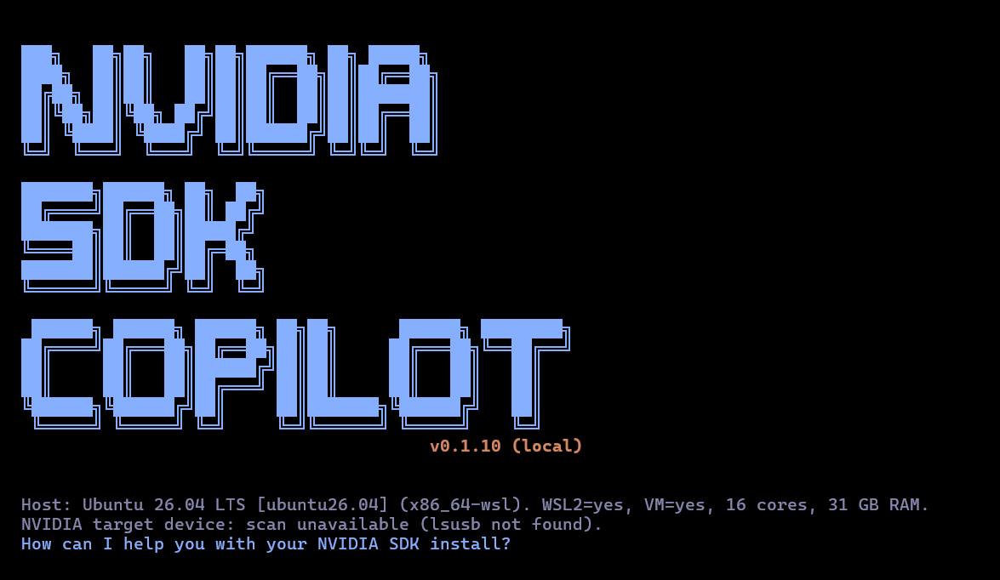

# NVIDIA SDK Copilot

**A terminal agent that helps you install, configure, and troubleshoot NVIDIA SDKs — grounded in real SDK Manager manifests, so it never makes up a version, size, or compatibility claim.**

<p align="center">
  
</p>

> [!WARNING]
> **Demo / prototype.** This is an experimental proof-of-concept, not a production tool and **not affiliated with or endorsed by NVIDIA**. Treat its install plans as a starting point, and always confirm privileged actions yourself.

> [!NOTE]
> **This is the v2 rewrite**, built on the [Deep Agents Code](libs/code/README.md) harness. The earlier architecture is archived at [**nvidia-sdk-advisor-v2-old**](https://github.com/mingdongt/nvidia-sdk-advisor-v2-old).

NVIDIA SDK Copilot is a Claude-Code–style coding agent in your terminal, specialized for one job: getting NVIDIA SDKs onto your machine and keeping them working. Ask it *"which JetPack runs on my Orin Nano?"* or *"how much disk does CUDA + TensorRT need?"* and it answers from a bundled, parsed copy of the SDK Manager manifests — not from the model's memory.

It is built on [LangChain's Deep Agents Code](libs/code/README.md) harness (TUI, file ops, shell, sub-agents, web search, human-in-the-loop), with a focused system prompt and **seven grounded manifest tools** layered on top.

---

## What it does

The agent helps with exactly three things, and politely declines everything else:

1. **Install advising & execution** — decide what to install for your goal and hardware, produce an install plan, and run it *with your approval*.
2. **Troubleshooting** — diagnose failed or broken installs, read the debug logs, and apply fixes.
3. **Reporting issues** — when something can't be resolved, help draft a report for the NVIDIA developer forum.

It covers NVIDIA SDK Manager, JetPack, CUDA, cuDNN, TensorRT, DOCA, and related components — including on Jetson devices.

## Why it's different: grounded in the manifest

LLMs love to confidently invent version numbers and download sizes. NVIDIA SDK Copilot doesn't. Every factual claim about a release — versions, compatibility, components, install/download size, dependencies, download URLs — is answered by querying a **deterministic SQLite database** (`manifest.db`) built from real SDK Manager manifests. The model is instructed to treat tool output as ground truth and to refuse rather than guess when a combination isn't supported.

The query tools are **read-only**: they describe what an install *would* do. The actual install, flash, or any `sudo`/destructive action runs through the harness's **human-approval-gated shell** — you see the exact command and confirm before anything happens.

### The seven manifest tools

| Tool | What it answers |
| --- | --- |
| `find_releases` | Which releases fit a product / host OS / board / arch — *"what JetPack works on my board?"* |
| `search_components` | Turn an intent (*"object detection"*, *"containers"*) into concrete component ids |
| `list_components` | What a release actually installs (host side vs. target side) |
| `component_detail` | One component's version, size, install side, and dependencies |
| `footprint` | Total install + download size for a release (or a subset) on a specific host |
| `resolve_deps` | Expand a selection to its full dependency closure |
| `build_plan` | The grounded install plan: components + download files + total size |

Typical flow: `find_releases` → `search_components` → `component_detail` / `footprint` / `resolve_deps` → `build_plan`.

`search_components` uses semantic search when an embedding backend is configured, and falls back to substring matching so it **always works offline**. Components are tagged with use cases (e.g. `edge-ai`, `cuda-programming`, `deep-learning-inference`) to map fuzzy intent to real components.

The design philosophy behind these tools — why they're kept small, read-only, and orthogonal, and when a high-frequency path earns a composite "recipe" tool — is written up in [**Tool design**](docs/tool-design.md).

### What's bundled

The shipped `manifest.db` is built from these SDK Manager manifests (see [libs/code/deepagents_code/data/sdkm/manifests/](libs/code/deepagents_code/data/sdkm/manifests/)):

- **JetPack** 6.1, 6.2, 6.2.1, 6.2.2, 7.0, 7.1, 7.2
- **DOCA** 1.5.1 (incl. multi-DPU), 2.2.0
- **CUDA Toolkit** 12.1
- **SDK Manager** 2.4.0

Because the database is bundled, the manifest tools turn on automatically — no setup, and they answer without any network access. (The agent's *reasoning* still calls an LLM provider; only the SDK facts are served locally.)

## Quickstart

Runs on Linux and macOS (and Windows via WSL). Requires [`uv`](https://docs.astral.sh/uv/) and Python 3.11+.

```bash
git clone https://github.com/mingdongt/nvidia-sdk-advisor-v2.git
cd nvidia-sdk-advisor-v2/libs/code
uv sync
uv run dcode
```

`dcode` is the agent command (inherited from the underlying Deep Agents Code harness). On first run it walks you through picking a model and adding an API key. Any LLM that supports tool calling works — set one of `ANTHROPIC_API_KEY`, `OPENAI_API_KEY`, or `GEMINI_API_KEY`, or run a local model via the `ollama` extra for a fully offline setup. Once you're in, just ask:

```text
> I have a Jetson Orin Nano on an Ubuntu 22.04 host. What can I install?
> I want to run object detection at the edge — what do I need and how big is it?
> My JetPack flash failed. Here's the log path — what went wrong?
```

The agent queries the manifest, shows you the grounded options, and proposes an install plan you approve before it runs.

## Configuration

All optional — the defaults work offline out of the box.

| Environment variable | Effect |
| --- | --- |
| `DEEPAGENTS_MANIFEST_DB` | Path to a custom `manifest.db` (overrides the bundled one). |
| `DEEPAGENTS_MANIFEST_EMBEDDER` | Enable semantic component search via `provider:model`, e.g. `openai:text-embedding-3-small` or `nvidia:NV-Embed-QA`. Takes precedence when set. Without it, search uses a local model if available, else falls back to substring matching. |
| `DEEPAGENTS_MANIFEST_ST_MODEL` | Local [`sentence-transformers`](https://www.sbert.net/) model for fully-offline embeddings (default `all-MiniLM-L6-v2`, requires the package installed). Used only when `DEEPAGENTS_MANIFEST_EMBEDDER` is unset. |

## Rebuilding the manifest database

The `sdkml3_*.json` files are the per-product manifests SDK Manager itself downloads to describe a release. To refresh the data or add releases, drop captured manifests into [the manifests directory](libs/code/deepagents_code/data/sdkm/manifests/) (with optional `<file>.url` siblings recording the source URL), then rebuild:

```bash
cd libs/code
uv run python -m deepagents_code.manifest_db build \
  deepagents_code/data/sdkm/manifests \
  deepagents_code/data/sdkm/manifest.db
```

Use-case tags are read from [`use_cases.json`](libs/code/deepagents_code/data/sdkm/use_cases.json) (a sibling of the manifests directory) and applied automatically. The command prints per-table row counts on success.

## Scope & safety

- **Never invents facts.** Versions, sizes, and compatibility always come from the manifest tools — if a combination isn't supported, the agent says so and offers a valid alternative.
- **Confirms before privileged actions.** Any `sudo`, flash, format, or partition-overwriting command is shown in full and waits for your explicit approval.
- **Read-only by default.** The seven manifest tools never download, install, or flash — they only describe. Execution stays behind the approval-gated shell.
- **Stays on task.** Off-topic requests (general coding, essays, chit-chat) are declined and steered back to SDK work.

## How it works

NVIDIA SDK Copilot is the [Deep Agents Code](libs/code/README.md) harness with two changes:

- **System prompt** — [`system_prompt.md`](libs/code/deepagents_code/system_prompt.md) defines the *NVIDIA SDK Copilot* persona, scope, and the "query the manifest before you answer" rule.
- **Manifest tools** — [`manifest_tools.py`](libs/code/deepagents_code/manifest_tools.py) exposes the seven read-only tools over [`manifest_db.py`](libs/code/deepagents_code/manifest_db.py) (SQLite) and [`manifest_vector.py`](libs/code/deepagents_code/manifest_vector.py) (semantic search). They auto-register whenever a `manifest.db` is present.

Everything else — the TUI, conversation resume, sub-agents, web search, sandboxes, persistent memory, skills, headless mode, and human-in-the-loop approvals — comes from the underlying harness.

## Roadmap

- [ ] **`plan_install` composite tool** — collapse the high-frequency, mechanical tail `resolve_deps → footprint → build_plan` into a single call, so the model wires those hops in code instead of threading `comp_ids` between three tool calls. The atomic seven stay for the long tail. Rationale and the "high-frequency × mechanical" criteria are in [Tool design](docs/tool-design.md#when-to-add-a-composite-tool).

## Built on Deep Agents

This project is a fork of [**Deep Agents Code**](libs/code/README.md), LangChain's open-source terminal coding agent ([upstream repo](https://github.com/langchain-ai/deepagents), [docs](https://docs.langchain.com/deepagents-code)), which is itself inspired by Claude Code. All the agent infrastructure is theirs; NVIDIA SDK Copilot adds the SDK-specific prompt, manifest tools, and data. Huge thanks to the LangChain team.

## License

MIT — see [LICENSE](LICENSE). Manifest data is parsed from publicly distributed NVIDIA SDK Manager manifests; NVIDIA, JetPack, CUDA, TensorRT, Jetson, and DOCA are trademarks of NVIDIA Corporation, used here for identification only. This project is not affiliated with NVIDIA.
